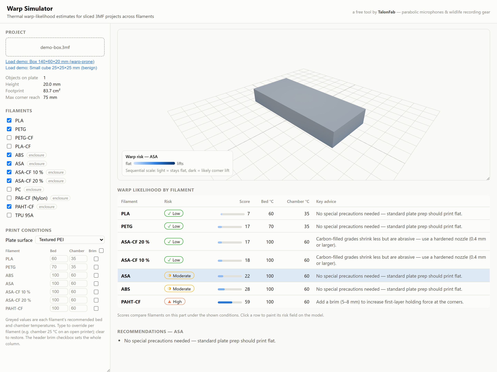

# Warp Simulator

A browser-based thermal warp-likelihood simulator for sliced 3MF projects.
Drop a `.3mf` (or `.stl`) on the page and it estimates how likely each filament
is to warp or lift off the plate for that specific part, paints a corner-lift
risk heatmap on the model, and suggests mitigations.

Everything runs client-side — no files leave the browser.

Built and maintained by [TalonFab](https://www.talonfab.com.au/) in Sydney,
Australia — we design field-ready wildlife recording gear, including
[parabolic microphones](https://www.talonfab.com.au/) and camera supports,
and use this tool to keep our 3D-printed parts flat on the plate.



## Features

- **Sliced `.3mf` support** — reads the root model, follows
  production-extension (`p:path`) object references, and applies build-plate
  transforms. Plain 3MF and STL (binary + ASCII) also work.
- **Multiple build plates** — plate layout is read from
  `Metadata/model_settings.config`, a plate picker switches between plates,
  and every object on a plate is simulated *separately* (each part shrinks
  toward its own centroid — two small parts far apart are not one huge part).
  The plate's score is its worst object.
- **Your sliced settings as defaults** — `Metadata/project_settings.config`
  supplies the filaments (pre-selected in the comparison), the selected plate
  type and its bed temperatures, chamber temperatures, and brim configuration;
  the printer class (enclosed vs actively-heated-chamber vs open frame)
  fills in a realistic chamber temperature when the profile doesn't control
  one. Everything remains overridable in the UI.
- **Filament library** — PLA, PLA-CF, PETG, PETG-CF, ABS, ASA, ASA-CF (10 %
  and 20 % fibre grades), PC, PA6-CF, PAHT-CF, TPU, each with lock-in
  temperature, shrink strain, road stiffness, bed adhesion, and chamber
  requirements.
- **Comparison table** — warp score (0–100) and risk bucket per filament under
  the same conditions, plus per-filament recommendations (brim, enclosure,
  bed temperature, adhesives, part reorientation).
- **3D heatmap** — per-vertex corner-lift risk painted on the part with a
  sequential colour scale; click a table row to switch filament.
- **Per-filament condition overrides** — bed temperature, chamber
  temperature, and brim can be set individually for every filament in the
  comparison (they're rarely the same); placeholders show each filament's
  resolved default, clearing an input restores it, and the header brim
  checkbox sets the whole column. The build-plate surface (textured PEI,
  smooth PEI, cool, high-tack) is selectable too and scales first-layer
  grip per polymer family — a cool plate holding ABS at half strength is
  flagged in the advice.

## How the simulation works

This is a fast physics-informed heuristic, not FEA. **The full write-up —
model, calibration evidence, and how to interpret the risk buckets — is in
[docs/how-it-works.md](docs/how-it-works.md).** In brief, it captures the
standard qualitative mechanics of FFF warping:

1. **Voxelisation.** The part is voxelised (column-parity fill) into up to
   ~96×96×160 cells to get per-layer cross-sections, the footprint, and each
   bottom cell's distance from the footprint centroid.
2. **Thermal field.** While printing, material at height *z* equilibrates to
   `T_env(z) = chamber + (bed − chamber)·e^(−z/7mm)` — the bed dominates near
   the plate and fades with height.
3. **Stress lock-in with a relaxation band.** A layer only accumulates
   *differential* shrink strain once it cools a whole relaxation band
   (~20 °C) below the material's lock-in temperature (≈ Tg for amorphous
   polymers like ABS/ASA/PC, ≈ crystallisation temperature for nylons like
   PAHT-CF) — material held just under lock-in still creeps its stress away
   over the minutes-long print. Layers the bed keeps warm shrink together
   with the part during final cooldown instead, which warps far less. This
   is why PLA on a 60 °C bed and PETG on a 70 °C bed print flat, why hot
   beds and chambers work, and why high-Tg ABS/PC and nylons — which sit far
   below lock-in even on a 100 °C bed — are the materials that warp.
4. **Corner lift with a saturating lever.** Peel stress at a bottom cell
   scales with road stiffness × locked-in strain × (distance from
   centroid)^1.5, where the effective distance saturates at ~90 mm — past a
   bending wavelength the base flexes instead of prying, so a 250 mm sheet
   is not radically worse than a 120 mm one. Peel saturates with part
   height and is resisted by the filament's first-layer adhesion (plus a
   brim bonus). The score is the 95th-percentile peel-to-adhesion ratio
   squashed to 0–100. Each object on the plate gets its own field; scores
   are calibrated against a table of known-outcome anchor prints
   (`tests/anchors.test.ts`).

Carbon-filled grades (ASA-CF, PAHT-CF, PETG-CF, PLA-CF) score lower than their
base polymers because fibre fill cuts shrink strain by ~3×, which outweighs
their higher stiffness. TPU scores low despite high shrink because a soft bead
stretches instead of peeling the corner up.

**Interpretation:** scores are calibrated for *relative* comparison between
filaments and geometries; treat the buckets (low / moderate / high / severe)
as guidance, not a guarantee.

## Development

```bash
cd apps/warp-sim
npm install
npm run dev        # local dev server
npm test           # vitest unit tests (parser, voxeliser, simulation ranking)
npm run build      # type-check + production build to dist/
```

The app is a standalone Vite + React + TypeScript project with its own
dependencies; it is intentionally not part of the root npm workspace.

## License

[MIT](LICENSE) © [TalonFab Pty Ltd](https://www.talonfab.com.au/). Use it,
fork it, ship it — a link back is appreciated.

## About TalonFab

[TalonFab](https://www.talonfab.com.au/) makes field-ready tools for
capturing wildlife: parabolic microphone systems for wildlife sound
recording, camera supports (ground pods, tripod accessories, hide mounts),
and nocturnal lighting mounts — designed, 3D-printed, and tested in Sydney,
Australia. This simulator started life as our in-house tool for predicting
which printed parts would warp before we burned a spool finding out.
